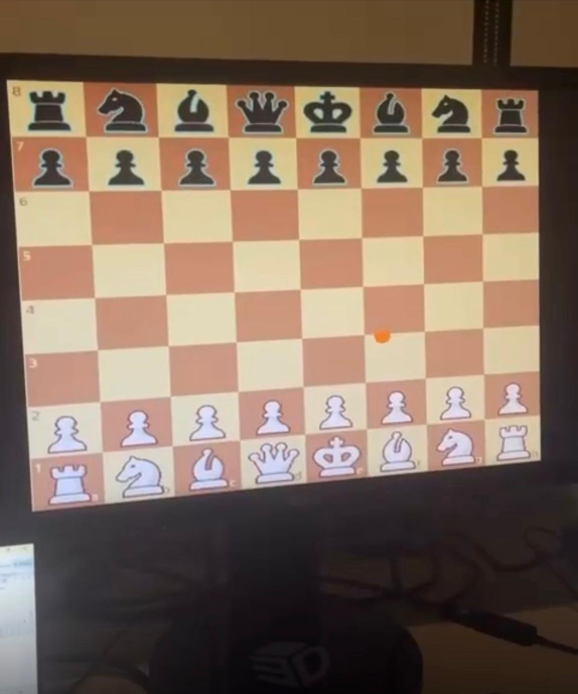

# FPGA Chess Interface

## Overview

This Project implements a hardware-accelerated chess interface on a custom System-on-Chip (SoC) platform. It utilizes mouse input for interaction and renders the chessboard display through HDMI. The design is built and deployed using Xilinx Vitis and is compatible with the Xilinx Spartan-7 xc7s50csga324-1 FPGA (found on the RealDigital Urbana Board).

## Features

- Mouse-controlled chessboard interaction
- HDMI-based visual output
- Custom SoC implementation
- Built and deployed using Xilinx Vivado and Vitis
- Targeted for the RealDigital Urbana Board

## Project Demo

The chessboard interface is rendered through HDMI and controlled using mouse input on the FPGA board.



## Design Statistics

The final FPGA implementation produced the following resource usage, timing, and power results:

```text
LUT Usage:       908
DSP Usage:       8
Memory (BRAM):   39
Flip-Flop Usage: 537
Latches:         0
Frequency:       118.50 MHz
Static Power:    0.075 W
Dynamic Power:   0.398 W
Total Power:     0.473 W
```
## Tools and Technologies

- **Hardware Description Language:** SystemVerilog
- **Software:** C
- **FPGA Tools:** Xilinx Vivado, Xilinx Vitis
- **Hardware:** RealDigital Urbana Board, Xilinx Spartan-7 FPGA
- **Interfaces:** HDMI display, USB mouse input

## Getting Started

### Prerequisites

Before running the project, make sure you have:

- Xilinx Vivado and Vitis installed
- A RealDigital Urbana Board or compatible Spartan-7 FPGA board
- A connected USB mouse
- An HDMI display
- A MicroUSB cable connected to the FPGA board

### Running the Project

1. Download and extract the project files.
2. Open Xilinx Vitis.
3. Import the project into the workspace.
4. Build the project if needed.
5. Connect the FPGA board, mouse, and HDMI display.
6. Press **Run** in Vitis to deploy the application.
7. Use the mouse to interact with the chessboard.

## Notes

- Ensure the mouse is connected before starting the application.
- The project currently supports basic cursor interaction and board navigation.

## Project Context

This project was developed by Russel De Leon and Vayun Gupta as a self-selected final project of ECE 385: Digital Systems Laboratory at the University of Illinois Urbana-Champaign.
